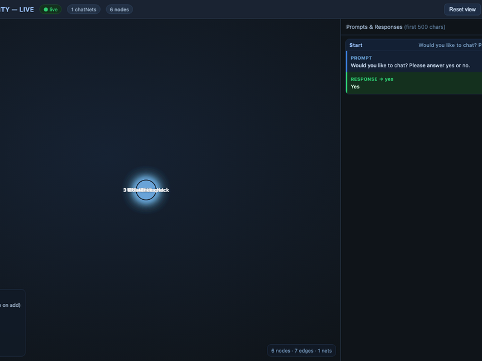

# Tabulairity

**TabulAIrity** is a Python framework designed for the extraction of structured tabular data from unstructured text using **Conversational Data Extraction Networks (CDENs)**.

Rather than relying on single-shot prompts, TabulAIrity constructs directed graphs of logic and prompts. This allows for complex, branching extraction workflows where the output of one node determines the trajectory of the conversation, ensuring higher accuracy and context-aware data structuring.

## Core Features

* **Conversational Data Extraction Networks:** Define complex extraction logic using directed graphs (NetworkX). Nodes represent LLM prompts, while edges define logic flows (e.g., `isYes`, `isNo`) based on model responses.
* **Model Agnostic Routing:** Built on top of `litellm`, supporting seamless routing between local models (Ollama) and remote APIs (OpenAI, etc.) via configurable routes.
* **Aggressive Caching:** Implements local file-based caching for LLM queries and web scraping to minimize latency and API costs during development and regression testing.
* **Automated Self-Improvement:** Includes an iterative optimization engine that refines prompts against ground-truth datasets to maximize extraction accuracy.
* **Integrated ETL Tools:** Built-in support for Google Sheets I/O, RSS feed ingestion, and automated translation.
* **Live Force-Directed Visualization (v1.3.2):** Optional real-time browser viz (`vizOn()`/`vizOff()`) showing the CDEN as an interactive D3.js force graph + streaming prompt/response panel — no new Python deps, works offline via vendored `d3.v7.min.js`.

## Modules

### `core.py` (Core)
The primary engine for the framework.
* **Network Construction:** Converts configuration DataFrames into executable `NetworkX` graphs (`buildChatNet`).
* **Execution:** Traverses the graph (`walkChatNet`), managing state (variables), executing prompts, and handling branching logic.
* **Infrastructure:** Manages model routing, API key injection, and response caching.

### `selfimprovement.py`
An automated prompt engineering module.
* **Iterative Optimization:** Takes a prompt and a test dataset (pandas DataFrame), then iteratively rewrites the prompt to improve performance against a supervisor model or ground truth.
* **Intent Extraction:** Analyzes prompts to ensure rewrites preserve the original user intent.
* **Error Summarization:** Aggregates failure cases to guide the supervisor model in specific improvements.

### `gsheetconnector.py`
I/O utilities for external data sources.
* **Google Sheets:** Read/write capabilities for integrating TabulAIrity with cloud-based spreadsheets.
* **Google Alerts/RSS:** Ingests RSS feeds, cleans HTML content, and prepares text for processing.

### `scrapertools.py`
Lightweight web scraping utilities.
* **Text Extraction:** Fetches URLs and utilizes `BeautifulSoup` to strip boilerplate (scripts, styles, nav) and return clean, sentence-structured text for LLM consumption.

### `visualization.py` (Live Viz — v1.3.2)
Zero-dependency (stdlib `http.server` + `threading`) live visualization. Default **OFF** — call `tb.vizOn()` after `import tabulairity` to start a local SSE server that streams graph events to a D3 v7 force-directed graph (vendored at `src/tabulairity/static/d3.v7.min.js` with CDN fallback).

* **Force graph:** per-chatNet colors, `idle`/`queued` (flash) /`processing` (glow) /`completed`/`error` nodes + `idle`/`true` (blue) /`false` (red/dashed) edges, collision + charge + link forces. Drag nodes to reposition (pinned on drag, double-click to release), scroll to zoom, drag background to pan.
* **Side panel:** FIFO 20, streaming `prompt → response` (500-char clipped, full text on click in popup with persona/fx/fullPrompt). Also streams standalone `askChatQuestion` calls.
* **Multi-chatNet:** each `buildChatNet`/`walkChatNet` gets a chatnet_id + LLM-generated title; animation gated 2 s per net then flushes, instant nets (<2 s) skip animation and snap to final colors; resets 4 s after completion.
* **API:** `tabulairity.vizOn(host="127.0.0.1", port=0, open_browser=True)` → URL, `vizOff()`.


*BlueDogs pipeline (800×600) — drag nodes, queued/processing glows, true/false edges. Run `PYTHONPATH=src python examples/bluedogs_viz_demo.py --mock` to reproduce.*

## Configuration

TabulAIrity relies on a specific directory structure for configuration and caching.

### Environment Setup
Create a `config/` directory in the project root containing the following:

1.  **`environment_args.txt`**: Stores API keys and proxy settings.
    ```text
    OPENAI_API_KEY = sk-...
    GEMINI_API_KEY = ...
    LITELLM_URL = http://localhost:4000/v1
    # Map host:port from model_routes.csv to the env var holding that host's key
    ROUTE_KEYS = {"localhost:11434": "OPENAI_API_KEY", "my-remote-host:80": "GEMINI_API_KEY"}
    ```
2.  **`model_routes.csv`**: Defines available models and endpoints.
    ```csv
    model,route,ip,key
    gemma3:12b,ollama/gemma3:12b,http://localhost:11434,
    gpt-4o,gpt-4o,http://remote.example.com:80,
    ```
    The optional `key` column lets you override the API key per route; otherwise the
    key is looked up via `ROUTE_KEYS` (host → env var name) and falls back to
    `OPENAI_API_KEY`.
3.  **`config.txt`**: General runtime settings (e.g., paths to Google Service credentials).

### Caching
The system automatically creates a `TabulAIrityCache.db` SQLite database (or a
PostgreSQL `cache` table when `psycopg2` is installed and configured) to store
MD5-hashed responses for every LLM query and scrape request. Clear/delete the
database to force fresh execution.

## Live Visualization — Quick Start (v1.3.2)

```python
import tabulairity as tb
import pandas as pd

tb.vizOn()  # → http://127.0.0.1:XXXX/  (opens browser, default OFF until called)

# BlueDogs demo pipeline (see examples/networks/BlueDogs.csv)
script = pd.read_csv("examples/networks/BlueDogs.csv").replace("*role", "Jim Smith from east Oklahoma")
G = tb.buildChatNet(script)          # emits graph_load → viz
result = tb.walkChatNet(G, fxStore, verbosity=1)  # streams node_queued/processing/completed + edge_evaluated + prompt_response
print(result["success"], result["errors"])

tb.vizOff()  # stop server
```

For a no-LLM smoke test: `PYTHONPATH=src python examples/bluedogs_viz_demo.py --mock --two --delay 0.8` (keeps server alive, auto-opens browser, runs two chatNets side-by-side).

## Usage Example

### Defining a Network
Networks are defined as DataFrames (or loaded from CSV/Google Sheets) with specific columns: `type` (node/edge), `prompt`, `fx` (logic function), and `persona`.

```python
import tabulairity as tb
import pandas as pd

# 1. Load your network definition
net_df = pd.read_csv('my_extraction_logic.csv')

# 2. Build the graph
chat_net = tb.buildChatNet(net_df)

# 3. Execute the network
# 'vars' can be pre-populated with text to analyze (e.g., {'scraped_text': '...'})
results = tb.walkChatNet(chat_net, varStore={'target_text': raw_text_data})

print(results['final_output_node'])
```

### Automated Prompt Improvement
```python
from tabulairity import selfimprovement as si

# Iterate on a prompt to maximize accuracy against a test dataframe
optimized_history = si.iteratePrompt(
    bestPrompt="Extract the date from [text]",
    bestPersona="You are a data extractor.",
    testDfIn=test_data_df,
    model="gemma3:27b"
)
```

## Dependencies

* `pandas`
* `networkx`
* `litellm`
* `beautifulsoup4`
* `gspread`
* `feedparser`
* `matplotlib`
* `pycountry`
* `langdetect`

Slide Deck:
[Slide Deck](https://docs.google.com/presentation/d/1A5SZgjTdp4PyHzKldXnDUMtvnwshi2Yv1uGauso26ZQ)
